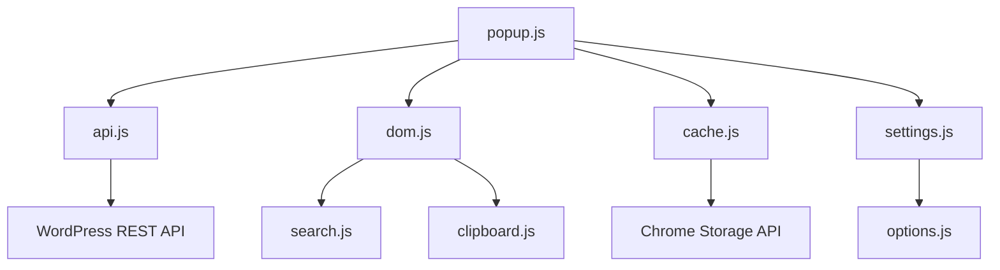

# WordPress URL Grabber - Technical Architecture

This document provides detailed technical information about the extension's implementation, architecture patterns, and API interactions.

## 🏗️ Architecture Overview

### Design Principles
- **Modular Architecture**: Single-responsibility files with clear separation of concerns
- **No External Dependencies**: Pure vanilla JavaScript for minimal footprint
- **Progressive Enhancement**: Graceful degradation for various WordPress configurations
- **Performance-First**: Caching, pagination, and async operations throughout

### Core Components



## 📁 File Structure & Responsibilities

### Core Files

#### `popup.js` (Main Orchestrator)
```javascript
// Main coordination between all modules
async function main() {
  // 1. Get current tab and extract base URL
  // 2. Check if site is WordPress
  // 3. Fetch post types and URLs
  // 4. Render results with cache statistics
  // 5. Setup event listeners
}
```

**Key Functions:**
- `main()`: Primary execution flow
- Event listener initialization
- Error handling and user feedback

#### `api.js` (WordPress Integration)
```javascript
// WordPress REST API detection and data fetching
async function fetchWordPressData(baseURL) {
  // 1. Check for cached post types
  // 2. Fetch available post types from /wp/v2/types
  // 3. Paginate through each post type's content
  // 4. Cache results per post type
  // 5. Return data with cache statistics
}
```

**Key Functions:**
- `checkWordPressSite()`: Multi-path WordPress detection
- `fetchAllItemsForPostType()`: Pagination handler
- `validateUrls()`: Optional URL accessibility checking
- `fetchJSON()`: Generic HTTP client with error handling

#### `cache.js` (Caching System)
```javascript
// Per-post-type caching with configurable expiration
function getPostTypeCacheKey(baseURL, postType, settings) {
  // Create unique keys based on URL + settings + post type
  return `cache_${baseURL}_${settings.perPageLimit}_${settings.validateUrls}_${postType}`;
}
```

**Key Functions:**
- `getCachedPostType()`: Individual post type cache retrieval
- `setCachedPostType()`: Immediate caching after processing
- `getCacheStats()`: Storage usage analytics
- `clearAllCache()`: Cache invalidation

#### `dom.js` (UI Rendering)
```javascript
// DOM manipulation with collapsible sections
function createSectionElement(postType, items) {
  // Create collapsible sections with:
  // - Toggle indicators (v/> icons)
  // - Click handlers for expand/collapse
  // - Smooth CSS animations
  // - URL lists with proper linking
}
```

**Key Functions:**
- `renderUrlsData()`: Main rendering with cache statistics
- `createSectionElement()`: Collapsible section creation
- `toggleSection()`: Expand/collapse functionality
- Status display management (`showStatus`, `showError`, `showLoading`)

#### `search.js` (Search & Filtering)
```javascript
// Real-time search with intelligent section handling
function filterUrls(searchTerm) {
  // 1. Filter URLs by search term
  // 2. Auto-expand sections with matches
  // 3. Highlight matching text
  // 4. Update result counts
  // 5. Preserve user collapse preferences
}
```

**Key Functions:**
- `filterUrls()`: Real-time URL filtering
- `highlightMatches()`: Text highlighting in yellow
- `autoExpandMatchingSections()`: Smart section expansion
- Search result statistics

#### `settings.js` (Configuration Management)
```javascript
// Chrome Storage API integration for user preferences
async function shouldValidateUrls() {
  return new Promise((resolve) => {
    chrome.storage.sync.get(['validateUrls'], (result) => {
      resolve(result.validateUrls === true); // Default false
    });
  });
}
```

**Key Functions:**
- `shouldValidateUrls()`: Validation preference
- `getPerPageLimit()`: Configurable fetch limits
- Chrome Storage API wrappers with defaults

#### `clipboard.js` (Copy Operations)
```javascript
// Clipboard API integration with user feedback
async function copyFilteredUrls() {
  // 1. Get currently visible/filtered URLs
  // 2. Format as text list
  // 3. Copy to clipboard
  // 4. Provide visual feedback
}
```

**Key Functions:**
- `copyFilteredUrls()`: Context-aware copying
- `formatUrlsForCopy()`: Text formatting
- Visual feedback with button state changes

### Configuration Files

#### `options.js` (Settings Page Logic)
```javascript
// Options page interaction and validation
document.getElementById('clearCache').addEventListener('click', async () => {
  const clearedCount = await clearAllCache();
  // Show user feedback with count
});
```

**Features:**
- Settings persistence to Chrome Storage
- Cache management interface
- Real-time validation of settings
- Performance impact warnings

## 🔄 Data Flow

### 1. Extension Launch
```
popup.js:main()
  → Get active tab URL
  → api.js:checkWordPressSite()
  → Detect REST API endpoints
```

### 2. WordPress Detection
```
api.js:checkWordPressSite()
  → Try /wp-json/, /index.php/wp-json/, /?rest_route=/
  → Parse JSON response or HTML indicators
  → Set global wpRestApiBasePath
```

### 3. Data Fetching with Caching
```
api.js:fetchWordPressData()
  → Get post types from /wp/v2/types
  → For each post type:
    → cache.js:getCachedPostType()
    → If cached and fresh: use cache
    → If not cached: api.js:fetchAllItemsForPostType()
    → cache.js:setCachedPostType()
  → Return {urlsData, cacheStats}
```

### 4. Pagination System
```
api.js:fetchAllItemsForPostType()
  → Start with perPage = min(desiredLimit, 100)
  → Loop: fetch page, increment, check for more
  → Handle API errors (fallback to perPage=100)
  → Break when: no more items OR desired limit reached
```

### 5. UI Rendering
```
dom.js:renderUrlsData()
  → Create collapsible sections
  → Display cache hit statistics
  → Setup search functionality
  → Enable copy buttons
```

## 🛠️ Technical Implementation Details

### Chrome Extension Architecture (Manifest V3)

```json
{
  "manifest_version": 3,
  "permissions": ["activeTab", "storage"],
  "action": {
    "default_popup": "popup.html"
  },
  "options_page": "options.html"
}
```

**Security Model:**
- `activeTab`: Only access current tab URL (minimal permissions)
- `storage`: Chrome Storage API for settings and cache
- No `host_permissions`: Uses CORS-safe requests

### WordPress REST API Integration

#### Endpoint Discovery
```javascript
const wpJsonPaths = [
  '/wp-json/',           // Standard WordPress
  '/index.php/wp-json/', // Permalink structure issues
  '/?rest_route=/'       // Fallback for restricted configs
];
```

#### Pagination Strategy
```javascript
// Handle WordPress pagination limits intelligently
while (totalFetched < desiredLimit) {
  const items = await fetchJSON(
    `${baseURL}${wpRestApiBasePath}wp/v2/${postType}?per_page=${currentPerPage}&page=${page}`
  );

  if (items.length < currentPerPage) break; // No more pages
  // Continue to next page...
}
```

### Caching Implementation

#### Cache Key Strategy
```javascript
// Unique keys prevent stale data when settings change
const cacheKey = `cache_${baseURL}_${perPageLimit}_${validateUrls}_${postType}`;
```

#### Expiration Handling
```javascript
const now = Date.now();
const expiryTime = cachedEntry.timestamp + (cacheExpiry * 1000);
if (now > expiryTime) {
  chrome.storage.local.remove([cacheKey]); // Auto cleanup
  return null;
}
```

### Error Handling Patterns

#### API Error Recovery
```javascript
try {
  const items = await fetchJSON(endpoint);
} catch (error) {
  if (error.message.includes('per_page must be between')) {
    // WordPress.org enforces max 100 per_page
    perPage = 100;
    continue; // Retry with lower limit
  }
  throw error; // Re-throw for other errors
}
```

#### User-Friendly Messages
```javascript
// Transform technical errors into actionable messages
if (err.message.includes('404')) {
  errorMessage += '\n\nPossible causes:\n• Site is not WordPress\n• WordPress REST API is disabled';
}
```

## 🎨 UI/UX Implementation

### Collapsible Sections
```css
.url-list {
  transition: all 0.3s ease;
  overflow: hidden;
}

.url-list.collapsed {
  max-height: 0;
  padding: 0;
  opacity: 0;
}
```

### Search Integration
```javascript
// Smart section handling during search
function filterUrls(searchTerm) {
  sections.forEach(section => {
    const hasMatches = section.urls.some(url =>
      url.toLowerCase().includes(searchTerm.toLowerCase())
    );

    if (hasMatches && !section.wasManuallyExpanded) {
      expandSection(section); // Auto-expand for matches
    }
  });
}
```

### Performance Indicators
```javascript
// Real-time cache status display
if (cachedCount > 0 && freshCount > 0) {
  cacheInfo.textContent = `💾 Partial cache hit: ${cachedCount} cached, ${freshCount} fresh post types`;
}
```

## ⚡ Performance Optimizations

### Concurrent Operations
- Multiple post types fetched in parallel where possible
- Immediate caching prevents redundant API calls
- Lazy loading for large URL lists

### Memory Management
- DOM elements created on-demand
- Event listeners properly cleaned up
- Cache size monitoring and cleanup

### Network Efficiency
- `credentials: "omit"` for CORS compatibility
- Pagination reduces memory footprint
- Configurable limits prevent excessive API calls

## 🔍 Debugging & Development

### Console Logging
```javascript
console.log(`[DEBUG] WordPress detected! Using REST API path: ${wpRestApiBasePath}`);
console.log(`[CACHE] Using cached data for ${baseURL}/${postType} (age: ${age}s)`);
console.log(`[DEBUG] Fetch summary: ${cachedCount} cached, ${freshCount} fresh post types`);
```

### Error Tracking
- Comprehensive try-catch blocks throughout
- Specific error messages for common failure modes
- Network request debugging with full response logging

### Performance Monitoring
- Timing logs for long operations
- Cache hit/miss statistics
- API response size tracking

## 🧪 Testing Considerations

### WordPress Configurations to Test
- Standard WordPress.org sites
- WordPress.com hosted sites
- Self-hosted with custom configurations
- Sites with disabled REST API
- Sites with custom post types
- Large sites (1000+ posts)

### Edge Cases
- Network timeouts during fetch
- Interrupted operations (page reload)
- Invalid URLs in WordPress data
- CORS restrictions
- API rate limiting

### Browser Compatibility
- Chrome 88+ (Manifest V3 requirement)
- Chromium-based browsers (Edge, Brave, Opera)
- Different screen sizes for popup display