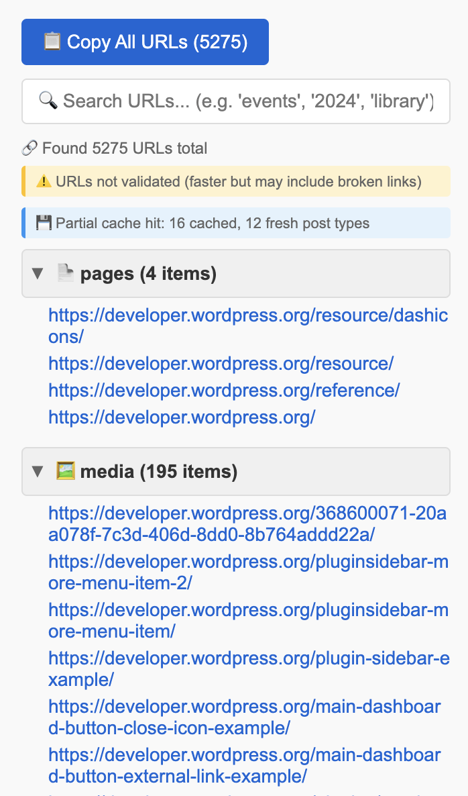
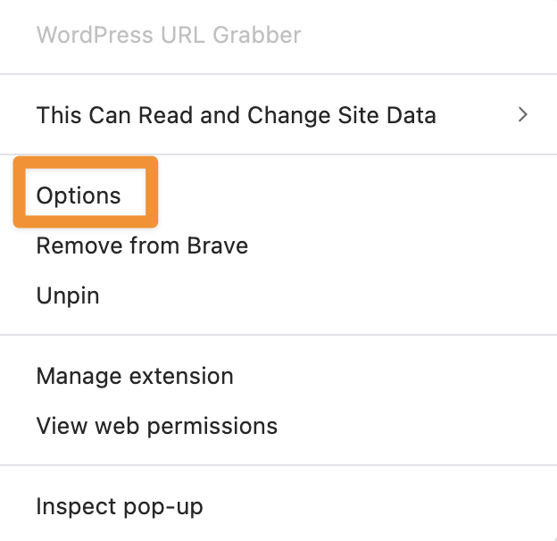
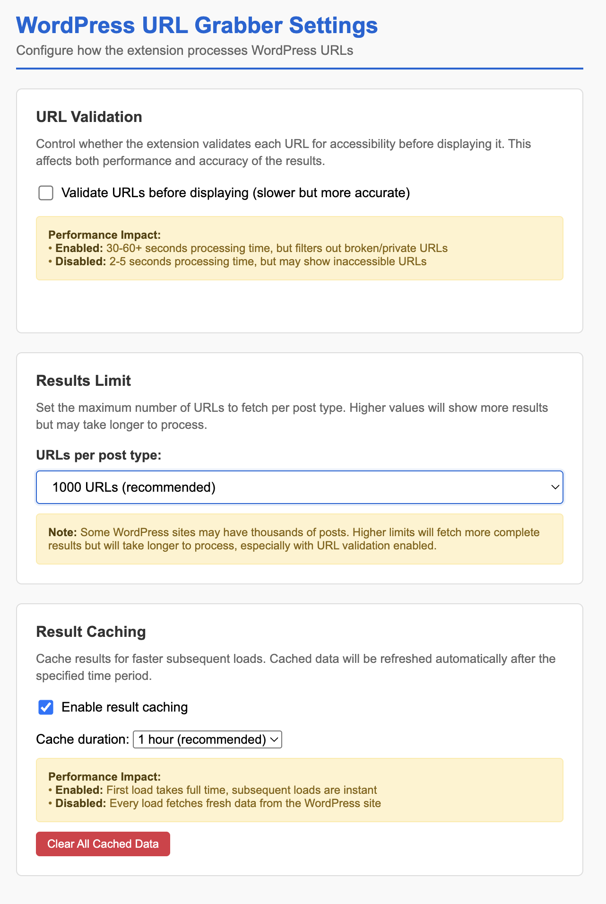

# WordPress URL Grabber

A powerful Chrome extension that extracts all public URLs from WordPress websites using the REST API. Perfect for SEO audits, content analysis, site migrations, or any task requiring comprehensive URL discovery.



## ✨ Features

### Core Functionality
- **🔍 Smart Detection**: Automatically detects WordPress sites and finds REST API endpoints
- **📋 Complete URL Extraction**: Fetches URLs from all post types (posts, pages, custom types)
- **⚡ High-Performance Fetching**: Handles large sites with pagination and configurable limits
- **📊 Organized Display**: URLs grouped by post type with collapsible sections

### User Experience
- **🎯 Advanced Search**: Real-time filtering with text highlighting and smart section expansion
- **📑 One-Click Copying**: Copy all URLs or just filtered results to clipboard
- **⚙️ Flexible Configuration**: Customizable settings for validation, caching, and fetch limits
- **💾 Smart Caching**: Per-post-type caching with interruption recovery
- **✅ URL Validation**: Optional accessibility checking (configurable for performance vs accuracy)

## 🚀 Installation

### Option 1: Chrome Web Store (Recommended)
*Coming soon - extension pending store approval*

### Option 2: Manual Installation
1. Download or clone this repository
2. Open Chrome and navigate to `chrome://extensions/`
3. Enable "Developer mode" (toggle in top right)
4. Click "Load unpacked" and select the extension directory
5. The WordPress URL Grabber icon will appear in your toolbar

## 📖 How to Use

### Basic Usage
1. **Navigate** to any WordPress website
2. **Click** the extension icon in your browser toolbar
3. **Wait** as the extension automatically:
   - Detects if the site is WordPress
   - Discovers available post types
   - Fetches and organizes all URLs

### Organizing Your View
- **Collapse/Expand**: Click any section header to toggle URL lists
- **Focus**: Keep irrelevant sections collapsed to focus on specific content types
- **Overview**: Headers always show post type name and total URL count

### Advanced Features
- **🔍 Search**: Use the search box to filter URLs by keyword
- **📋 Smart Copying**: Copy all URLs or just filtered results with one click
- **⚙️ Extensive Configuration**: Access settings through extension options

### Performance Modes
- **Fast Mode** (validation disabled): 2-5 seconds, may include broken URLs
- **Accurate Mode** (validation enabled): 30-60+ seconds, filters out inaccessible URLs

## ⚙️ Extension Settings

Access the settings page by **right-clicking the extension icon** in your browser toolbar and selecting **"Options"**, or go to `chrome://extensions/` and click "Details" → "Extension options".

<!--  -->

### Configuration Options



#### **🔍 URL Validation**
Controls whether each URL is tested for accessibility before display:
- **✅ Enabled**: 30-60+ seconds processing, filters out broken/private URLs
- **❌ Disabled**: 2-5 seconds processing, may include inaccessible URLs
- **Default**: Disabled (prioritizes speed over accuracy)

#### **📊 Results Limit**
Sets maximum URLs fetched per post type:
- **Options**: 100, 500, 1000, 2000, 5000 URLs
- **Default**: 1000 URLs (recommended balance)
- **Impact**: Higher limits = more complete results but longer processing time

#### **💾 Result Caching**
Enables intelligent caching for faster subsequent loads:
- **Cache Toggle**: Enable/disable result caching
- **Cache Duration**: 5 minutes to 24 hours
- **Default**: Enabled with 1 hour expiration
- **Benefits**: First load takes full time, subsequent loads are instant
- **Clear Cache**: Button to manually clear all cached data

### **Performance Impact Guide**
| Setting | Speed | Completeness | Accuracy |
|---------|-------|--------------|----------|
| Validation ON + High Limits + Cache OFF | Very Slow | Excellent | Perfect |
| Validation OFF + Medium Limits + Cache ON | Fast | Good | Good |
| Validation OFF + Low Limits + Cache ON | Very Fast | Basic | Fair |

## 🔧 System Requirements

- **Browser**: Chrome 88+ or Chromium-based browsers (Edge, Brave, etc.)
- **Target Sites**: WordPress websites with REST API enabled
- **Permissions**: Only requires `activeTab` for security

## 🌐 WordPress Compatibility

### Supported Configurations
- ✅ Standard WordPress installations
- ✅ Headless WordPress setups
- ✅ Custom post types and fields
- ✅ Multisite networks
- ✅ WordPress.com and self-hosted sites

### REST API Endpoints
Automatically detects and works with:
- `/wp-json/` (standard)
- `/index.php/wp-json/` (permalink issues)
- `/?rest_route=/` (fallback method)

## ⚡ Performance & Caching

### Smart Caching System
- **Per-post-type caching**: Each content type cached independently
- **Interruption recovery**: Reload page mid-fetch to see cached results
- **Configurable expiration**: 5 minutes to 24 hours
- **Cache statistics**: See what's loaded from cache vs fresh

### Fetch Optimization
- **Automatic pagination**: Handles WordPress API limits intelligently
- **Configurable limits**: 100-5000 URLs per post type
- **Parallel processing**: Multiple post types fetched concurrently where possible
- **Progress indicators**: Detailed status updates during long operations

## 🛠️ Troubleshooting

### Common Issues
| Issue | Solution |
|-------|----------|
| "Not a WordPress site" | Site may have disabled REST API or uses custom endpoints |
| Slow loading | Enable caching or reduce per-post-type limits in settings |
| Missing URLs | Increase fetch limits or disable validation for faster results |
| CORS errors | Try refreshing the page - usually temporary |

### Getting Help
- Check browser console for detailed error logs
- Ensure WordPress REST API is accessible at `/wp-json/`
- Try different post type limits if timeouts occur
- Clear cache if seeing stale data

## 📂 Project Files

For technical implementation details, see [ARCHITECTURE.md](ARCHITECTURE.md).

```
├── manifest.json          # Extension configuration & permissions
├── popup.html             # Main popup interface
├── options.html           # Settings page
├── css/styles.css         # All popup styling
└── js/                    # Modular JavaScript files
    ├── popup.js           # Main orchestration
    ├── api.js             # WordPress API integration
    ├── cache.js           # Caching system
    ├── dom.js             # UI rendering
    ├── search.js          # Filtering & search
    ├── clipboard.js       # Copy functionality
    ├── settings.js        # Configuration management
    └── options.js         # Settings page logic
```

## 🤝 Contributing

Contributions welcome! The codebase uses:
- Modular architecture with single-responsibility files
- Vanilla JavaScript (no framework dependencies)
- Comprehensive error handling and logging
- Modern Chrome extension APIs (Manifest V3)

## 📄 License

MIT License - see [LICENSE](LICENSE) file for details.